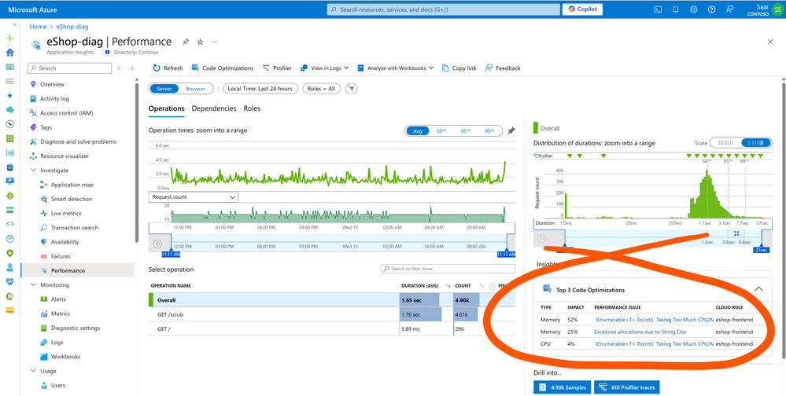

# Application Insights Profiler for ASP.NET Core

[](https://www.nuget.org/packages/Microsoft.ApplicationInsights.Profiler.AspNetCore/)


## Announcement

* Upgrade to [2.7.0](https://www.nuget.org/packages/Microsoft.ApplicationInsights.Profiler.AspNetCore/2.7.0). Reduced the telemetry noise. Check out the details in the [release notes](https://github.com/microsoft/ApplicationInsights-Profiler-AspNetCore/releases/tag/v2.7.0).

* Running inside Azure Fucntion? Follow [this example](./examples/EnableServiceProfilerForAzureFunction).

## Previous announcements

* Worker service support is in beta testing now.
  * Check out [the example](./examples/ServiceProfilerInWorkerNet6/Readme.md) for package info and the instructions.

## Description

Welcome to the home page of `Microsoft Application Insights Profiler for ASP.NET Core`. Enable profiler, integrate seamlessly with your Application Insights resource, and unlock powerful [Code Optimizations](https://learn.microsoft.com/azure/azure-monitor/insights/code-optimizations-profiler-overview#code-optimizations) for your .NET applications.

> ⭐ Not sure which `Profiler Agent` is right for you? Check out our [Profiler Agent Selection Guide](https://github.com/Azure/azuremonitor-opentelemetry-profiler-net/blob/main/docs/ProfilerAgentSelectionGuide.md) to help you choose the best option for your needs.


## Getting Started

> ⚠️ These instructions are for **ASP.NET Core applications**. For **Worker Services**, refer to [this example](./examples/ServiceProfilerInWorkerNet6/Readme.md). If you are using **OpenTelemetry** instead of **application insights SDK**, please go to [Azure Monitor OpenTelemetry Profiler](https://github.com/Azure/azuremonitor-opentelemetry-profiler-net).

1. **Create a New Application**

    For example:

    ```shell
    dotnet new webapi
    ```

1. **Add NuGet Packages**

    ```shell
    dotnet add package Microsoft.ApplicationInsights.AspNetCore
    dotnet add package Microsoft.ApplicationInsights.Profiler.AspNetCore
    ```

1. **Enable Application Insights Profiler**

    Modify [Startup.cs](./examples/QuickStart3_0/Startup.cs) or [Program.cs](./examples/EnableServiceProfilerNet8/Program.cs) to include:

    ```csharp
    public void ConfigureServices(IServiceCollection services)
    {
        ...
        // Add Application Insights and Profiler
        services.AddApplicationInsightsTelemetry();
        services.AddServiceProfiler();
    }
    ```

1. **Optionally, Add a Bottleneck**

    * Add a reference to `HeavyArrayForcast`, for example, in [QuickStart3_1.csproj](examples/QuickStart3_1/QuickStart3_1.csproj):

        ```xml
        <ItemGroup>
            <ProjectReference Include="..\PerfIssueLib\HeavyArrayForecast\HeavyArrayForecast.csproj" />
        </ItemGroup>
        ```

    * Use it in [WeatherForecastController.cs](examples/QuickStart3_1/Controllers/WeatherForecastController.cs):

        ```csharp
        using HeavyArrayForecast;
        ...

        [HttpGet]
        public IEnumerable<WeatherForecast> Get()
        {
            return WeatherForecastHelper.GetForecasts();
        }
        ```

    _Note: Check [WeatherForecastHelper.cs](examples/PerfIssueLib/HeavyArrayForecast/WeatherForecastHelper.cs) for details on the issue. If you prefer not to use project-to-project references, you can copy the code from this file directly into your project._

1. **Set Up Connection String**:

    In [appsettings.Development.json](examples/QuickStart3_1/appsettings.Development.json), add:

    ```jsonc
    {
        ...
        "ApplicationInsights": {
            "ConnectionString": "replace-with-your-connection-string"
        }
        ...
    }
    ```

1. **Run and Profile the Application**

    Start your application:

    ```shell
    dotnet run
    ```

    The profiler will automatically start for 2 minutes. Access the endpoint during this period:

    ```url
    https://localhost:5001/weatherforecast
    ```

## Trace Analysis

1. **Analyze Traces in Azure Portal**

    Wait a few minutes for data ingestion. In the Azure Portal, navigate to your Application Insights resource, go to the **Performance** blade, and click `Profiler` to view profiling sessions:

    

    _Tip: Click on a trace to open the trace analyzer._

1. **Review Code Optimizations**

    Once Profiler traces are available in the Azure portal for your application, they are automatically analyzed by an AI-based service known as `Code Optimizations`. This service helps detect and remediate performance bottlenecks at the code level for your running .NET applications. This analysis does not incur any additional overhead on your server or costs to your bill.

    To review the available Code Optimizations:

    1. Navigate to the **Performance** blade.
    1. You might see the top 3 recommendations in the **Insights** card.
    1. Alternatively, click on the **Code Optimizations** button.

    _Note that it may take a few hours for Code Optimizations to appear._

    

    For more information, refer to the [Code Optimizations Documentation](https://aka.ms/CodeOptimizations/Docs).

## Troubleshoot

* Unable to see profile traces? Check out our [troubleshooting guide](./docs/Troubleshoot.md).

## Next Steps

* [Profiler Configurations](./Configurations.md) -  Customize profiler settings.
* [Dockerize with Profiler](./examples/QuickStart3_0/Readme2.md)
* [Profiler Sessions](./ProfilerSessions.md) - Details on profiler operations.
* [Trace Analysis](https://docs.microsoft.com/en-us/azure/application-insights/app-insights-profiler-overview?toc=/azure/azure-monitor/toc.json#view-profiler-data) - Learn about trace analysis. For example, what does `AWAIT TIME`, `Blocked time`, `Unmanaged Async` means, etc.
* [Diagnosing High CPU Usage](https://github.com/Azure/azure-diagnostics-tools/blob/master/Profiler/TriggerProfiler.md).
* [Call tree filter](https://github.com/Azure/azure-diagnostics-tools/blob/master/Profiler/CallTreeFilter.md).

## Supported Versions

Refer to the [Support Matrix](./SupportMatrix.md) to determine the appropriate profiler version.

## Examples

* [Enable Service Profiler for containerized ASP.NET Core application (.NET Core 3.x)](./examples/QuickStart3_0/Readme.md).

* [Enable Service Profiler for ASP.NET Core application in Visual Studio](./examples/EnableServiceProfilerInVSCLR2_1).

* [Worker Service Example](./examples/ServiceProfilerInWorkerNet6/Readme.md).

* [Browse examples](./examples/).

## References

* [Profile ASP.NET Core Azure Linux web apps with Application Insights Profiler](https://docs.microsoft.com/en-us/azure/application-insights/app-insights-profiler-aspnetcore-linux)

## CAUTION

This is a documentation/sample repository. The [LICENSE](LICENSE) covers the content in this repository but does **NOT** cover the use of the product of Microsoft.ApplicationInsights.Profiler.AspNetCore. Please reference [EULA-prerelease.md](EULA-prerelease.md) for any prerelease product and [EULA-GA.md](EULA-GA.md) for any non-prerelease product.

## Contributing

This project welcomes contributions and suggestions.  Most contributions require you to agree to a
Contributor License Agreement (CLA) declaring that you have the right to, and actually do, grant us
the rights to use your contribution. For details, visit <https://cla.microsoft.com>.

When you submit a pull request, a CLA-bot will automatically determine whether you need to provide
a CLA and decorate the PR appropriately (e.g., label, comment). Simply follow the instructions
provided by the bot. You will only need to do this once across all repositories using our CLA.

This project has adopted the [Microsoft Open Source Code of Conduct](https://opensource.microsoft.com/codeofconduct/).
For more information see the [Code of Conduct FAQ](https://opensource.microsoft.com/codeofconduct/faq/) or
contact [opencode@microsoft.com](mailto:opencode@microsoft.com) with any additional questions or comments.
