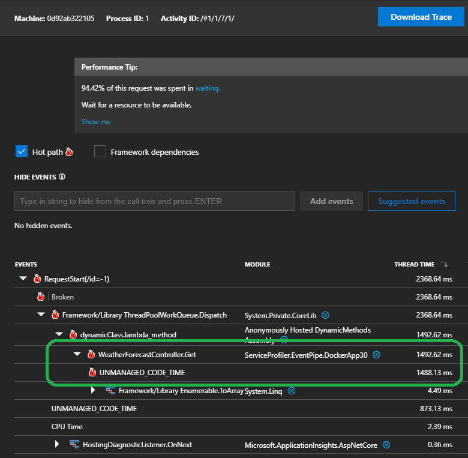
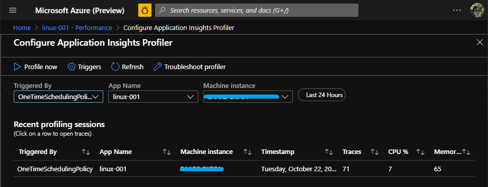

# Application Insights Profiler for ASP.NET Core

[](https://www.nuget.org/packages/Microsoft.ApplicationInsights.Profiler.AspNetCore/)


## Announcement

* Upgrade to [2.7.0](https://www.nuget.org/packages/Microsoft.ApplicationInsights.Profiler.AspNetCore/2.7.0). Reduced the telemetry noise. Check out the details in the [release notes](https://github.com/microsoft/ApplicationInsights-Profiler-AspNetCore/releases/tag/v2.7.0).

* Running inside Azure Fucntion? Follow [this example](./examples/EnableServiceProfilerForAzureFunction).

## Previous announcements

* Worker service support is in beta testing now.
  * Check out [the example](./examples/ServiceProfilerInWorkerNet6/Readme.md) for package info and the instructions.

## Description

This is the project home page for `Microsoft Application Insights Profiler for ASP.NET Core`. The NuGet packages can be found [here](https://www.nuget.org/packages/Microsoft.ApplicationInsights.Profiler.AspNetCore/).



## Get Started

> ⚠️ These are steps for the **ASP.NET Core** applications. For the **Worker Service**, refer to [this example](./examples/ServiceProfilerInWorkerNet6/Readme.md).

* Create an application

```shell
dotnet new webapi
```

* Add NuGet packages

```shell
dotnet add package Microsoft.ApplicationInsights.AspNetCore
dotnet add package Microsoft.ApplicationInsights.Profiler.AspNetCore
```

_Notice: .NET Core 2.2 is **out of support**, it is recommended to migrate your project to .NET 6.x. Refer to [.NET Core](https://dotnet.microsoft.com/download/dotnet-core) page for details. If you have to stay on .NET Core 2.2 for now, please this specific version of [`Microsoft.ApplicationInsights.AspNetCore v2.14`](https://www.nuget.org/packages/Microsoft.ApplicationInsights.AspNetCore/2.14.0) alone with the profiler package._

_Tips: Find official migration documentation [here](https://docs.microsoft.com/en-us/aspnet/core/migration/22-to-30?view=aspnetcore-3.1&tabs=visual-studio)._

* Enable Application Insights Profiler

Open [Startup.cs](./examples/QuickStart3_0/Startup.cs)

```csharp
using System.Diagnostics;
...
// This method gets called by the runtime. Use this method to add services to the container.
public void ConfigureServices(IServiceCollection services)
{
    ...
    // Adding the following lines to enable application insights and profiler.
    services.AddApplicationInsightsTelemetry();
    services.AddServiceProfiler();
}
```

* Add a bottleneck

To make it real, make use the following code to add some delay in the [WeatherForecastController.cs](examples/QuickStart3_0/Controllers/WeatherForecastController.cs) to simulate the bottleneck:

```csharp
using System.Threading;
...
private static void SimulateDelay()
{
    // Delay for 200ms to 5s to simulate a bottleneck.
    Thread.Sleep((new Random()).Next(200, 5000));
}
```

And call it from the controller methods:

```csharp
[HttpGet]
public IEnumerable<WeatherForecast> Get()
{
    SimulateDelay();
    var rng = new Random();
    return Enumerable.Range(1, 5).Select(index => new WeatherForecast
    ...
}
```

* Setup the connection string for debugging

In [appsettings.Development.json](examples/QuickStart3_0/appsettings.Development.json), add the following configuration:

```jsonc
{
    ...
    "ApplicationInsights": {
        "ConnectionString": "replace-with-your-connection-string"
    }
    ...
}
```

* Alternatively, use a connection string like in [QuickStart3.1 example](./examples/QuickStart3_1/appsettings.Development.json).

* Run the WebAPI, generate traffic for profiling

To run your application locally:

```shell
dotnet run
```

At the beginning of the application, **OneTimeSchedulingPolicy** will immediately kick in, profiling for 2 minutes. Hit the endpoint in a browser during the profiling session in your browser:

```url
https://localhost:5001/weatherforecast
```

* Analyze the trace from Azure Portal

Get a coffee and wait for a couple of minutes - the backend needs some time, usually a 2 minutes, to ingest the data.

Then, open the application insights resource in Azure Portal, go to the **performance** blade, and use the button of `Configure Profiler`. There, you are going to see all profiling sessions:



_Tip: Click on the trace to open the trace analyzer._

## Next

* [Configurations for the Profiler](./Configurations.md) - describes how to customize various settings of the profiler.
* [Dockerize an application with Profiler](./examples/QuickStart3_0/Readme2.md)
* [Profiler Sessions](./ProfilerSessions.md) - describes when the profiler starts, stops and what is traced.
* [Trace Analysis](https://docs.microsoft.com/en-us/azure/application-insights/app-insights-profiler-overview?toc=/azure/azure-monitor/toc.json#view-profiler-data) - introduce the trace analysis, get a basic understanding of `AWAIT TIME`, `Blocked time`, `Unmanaged Async`, etc.
* [Diagnosing a WebAPI experiencing intermittent high CPU using the Application Insights Profiler](https://github.com/Azure/azure-diagnostics-tools/blob/master/Profiler/TriggerProfiler.md).
* [The call tree filter](https://github.com/Azure/azure-diagnostics-tools/blob/master/Profiler/CallTreeFilter.md).

## Supported Versions

To find out the proper version of the Profiler to use, please refer to [Support Matrix](./SupportMatrix.md).

## Examples

* [Enable Service Profiler for containerized ASP.NET Core application (.NET Core 3.x)](./examples/QuickStart3_0/Readme.md).

* [Enable Service Profiler for ASP.NET Core application in Visual Studio](./examples/EnableServiceProfilerInVSCLR2_1).

* [Application Insights Profiler for Worker Service Example](./examples/ServiceProfilerInWorkerNet6/Readme.md).

## References

* [Profile ASP.NET Core Azure Linux web apps with Application Insights Profiler](https://docs.microsoft.com/en-us/azure/application-insights/app-insights-profiler-aspnetcore-linux)

## CAUTION

This is a documentation/sample repository. The [LICENSE](LICENSE) covers the content in this repository but does **NOT** cover the use of the product of Microsoft.ApplicationInsights.Profiler.AspNetCore. Please reference [EULA-prerelease.md](EULA-prerelease.md) for any prerelease product and [EULA-GA.md](EULA-GA.md) for any non-prerelease product.

## Contributing

This project welcomes contributions and suggestions.  Most contributions require you to agree to a
Contributor License Agreement (CLA) declaring that you have the right to, and actually do, grant us
the rights to use your contribution. For details, visit https://cla.microsoft.com.

When you submit a pull request, a CLA-bot will automatically determine whether you need to provide
a CLA and decorate the PR appropriately (e.g., label, comment). Simply follow the instructions
provided by the bot. You will only need to do this once across all repositories using our CLA.

This project has adopted the [Microsoft Open Source Code of Conduct](https://opensource.microsoft.com/codeofconduct/).
For more information see the [Code of Conduct FAQ](https://opensource.microsoft.com/codeofconduct/faq/) or
contact [opencode@microsoft.com](mailto:opencode@microsoft.com) with any additional questions or comments.
