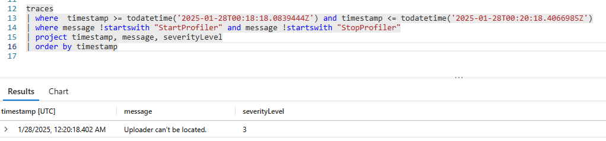
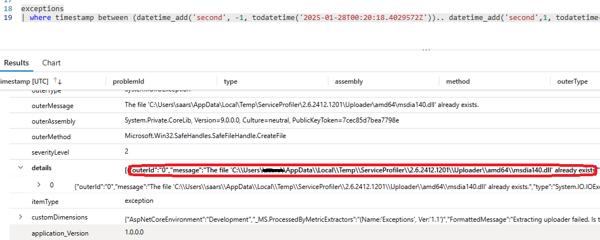

# Troubleshoot

This article presents troubleshooting steps and information to enable you to use `Microsoft.ApplicationInsights.Profiler.AspNetCore`.

**Query tips**

* Use a time range like `> ago(30m)` for recent incidents. If the incident is older, expand the time range.
* Start with a broader range, such as `> ago(30d)`, to identify key events, then narrow it down for more specific results.

## Are you connecting to the correct Application Insights resource

* Profiler depends on the correct connection to Application Insights.
  1. Check the connection string to make sure it is pointing to the correct Application Insights resource.
  1. Query `Application Insights` / `Log Analytics Workspace` to make sure there are **Request** telemetries.

      For example:

      ```kql
      requests
      | where timestamp > ago(30m)
      | project timestamp, name, resultCode, cloud_RoleInstance
      | where cloud_RoleInstance == 'your-instance-name'
      | limit 5
      ```

      * `requests` - Looking for **request** telemetry.
      * `where timestamp > ago(30m)` - looking for records from the last 30 minutes.
      * `project ...` - keep the interesting columns.
      * `where cloud_RoleInstance == 'your-instance-name'` - filter for noise.
      * `limit 5` - limit the result to 5 records.

      Notes: _It is possible for multiple instances to send data into the same Application Insights component. Filter by `Cloud_RoleInstance` accordingly._

      If there's no Application Insights records, make sure Application Insights is setup correctly. Refer to [ApplicationInsights-dotnet](https://github.com/microsoft/ApplicationInsights-dotnet) for more details.

## Are there correct Profiler related trace events in the Application Insights

  1. Query trace to find out a Profiler session

      For example:

      ```kql
      traces
      | where timestamp > ago(30m)
      | where message startswith "StartProfiler" or message startswith "StopProfiler"
      | where cloud_RoleInstance == 'your-instance-name'
      | order by timestamp desc
      ```

      You should see 4 events for each profiling cycle, with timestamps on them:
        * StartProfiler triggered
        * StartProfiler succeeded
        * StopProfiler triggered
        * StopProfiler succeeded

      If there's no such event, the profiler instrument failed. Refer to [Get Started](../README.md) to verify the proper package, and code are added to your project. Otherwise, continue.

  1. Query a specific session

      When those events exist, it will be interesting to see if there's something going on. Firstly, find out the `timestamp` on start, stop of the traces from the records above, and form up a query:

      ```kql
      traces
      | where  timestamp >= todatetime('2025-01-28T00:18:18.0839444Z') and timestamp <= todatetime('2025-01-28T00:20:18.4066985Z')
      | where message !startswith "StartProfiler" and message !startswith "StopProfiler"
      | order by timestamp
      ```

      When there's a problem, the trace will usually give out a clue. For example:

      

      It is also a good idea to search around for exceptions, for example, noting the timestamp above and query:

      ```kql
      exceptions
      | where timestamp between (datetime_add('second', -1, todatetime('2025-01-28T00:20:18.4029572Z')).. datetime_add('second',1, todatetime('2025-01-28T00:20:18.4029572Z')))
      ```

      Given maybe 2 seconds wiggling room, the query above would reveal exception details about what went wrong. For example:

      

      That indicates that somehow the uploader exists, but wasn't proper detected. It tries to extract the same file to the target location. Profiler, on the safe side, would not execute the overwriting automatically.

  At this point, it should be clear what is causing Profiler fail to run.

## Further support

If you still can't find out the issue, or if the issue is on the package, please feel free to [open an issue](https://github.com/microsoft/ApplicationInsights-Profiler-AspNetCore/issues).
