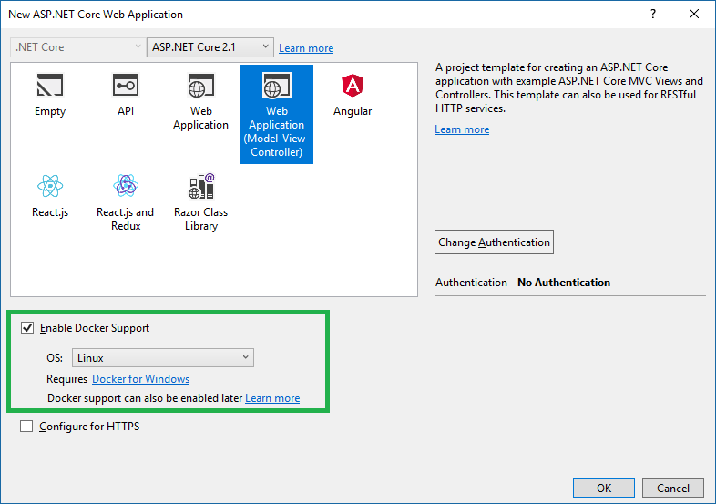
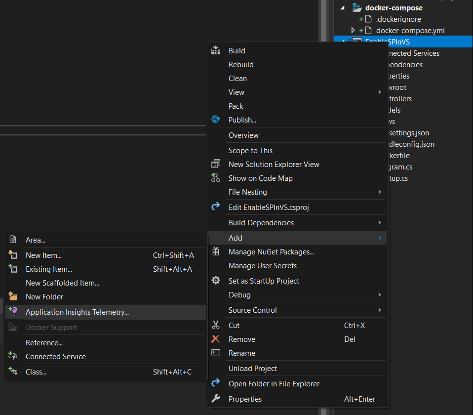
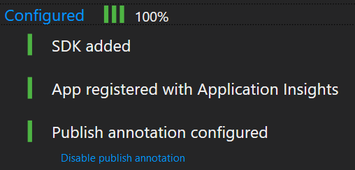
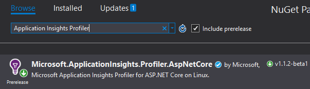
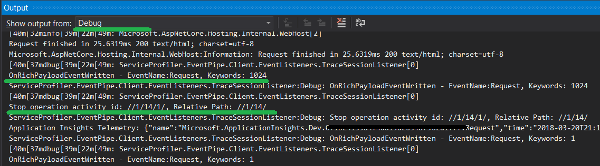
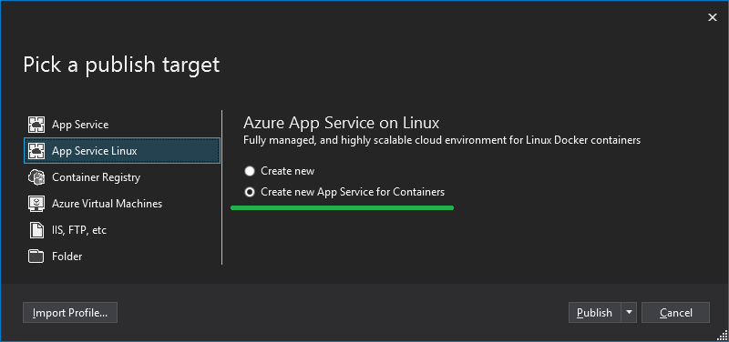
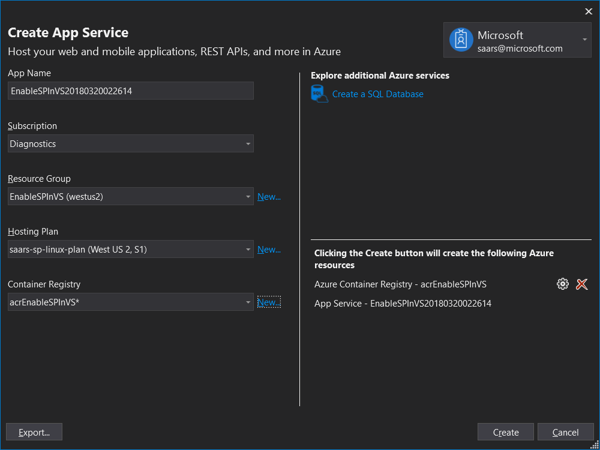

# Enable Service Profiler for ASP.NET Core application in Visual Studio

> ⚠️ .NET Core 2.1 has reached its end of support. For information on upgrading, please visit <https://dot.net>.

Enable Service Profiler for ASP.NET Core application in Visual Studio is easy. We will walk through the basic steps.

## Create the ASP.NET Core Web Application with Docker Support

Let's start by creating an ASP.NET Core Web Application, we will name it `EnableSPInVS`. You can choose to start with an existing project as well.

During the creation of the project, we will enable the docker support like this:



The same goal could be reached by adding docker support to an existing project like it here: [Visual Studio Tools for Docker with ASP.NET Core](https://docs.microsoft.com/en-us/aspnet/core/host-and-deploy/docker/visual-studio-tools-for-docker).

To make it real, make use the following code to add some delay in the controllers to simulate the bottleneck:

```CSharp
private void SimulateDelay()
{
    // Delay for 500ms to 2s to simulate a bottleneck.
    Thread.Sleep((new Random()).Next(500, 2000));
}
```

Reference [HomeController.cs](./AppInsightsProfilerExample/Controllers/HomeController.cs) for full code.

## Enable Application Insights

Add support for application insights by using the context menu: `Add` | `Application Insights Telemetry...` and then follow the wizard:



For detailed step by step instructions, please reference [Application Insights for ASP.NET Core](https://docs.microsoft.com/en-us/azure/application-insights/app-insights-asp-net-core).

At the end of the wizard, it is expected to see Application Insights being fully configured.



## Add a reference to ServiceProfiler

Right-click on the project in Solution Explorer, choose `Manage NuGet Packages...` and the reference to the NuGet Package of `Microsoft.ApplicationInsights.Profiler.AspNetCore`.



Then, turn on Service Profiler in `Startup.cs`:

```csharp
        public void ConfigureServices(IServiceCollection services)
        {
            // This statement adds Profiler to the application.
            services.AddServiceProfiler();
            services.AddMvc().SetCompatibilityVersion(CompatibilityVersion.Version_2_2);
        }
```

Save and build the project. F5 for a Debug. In the output window, it is expected to see the Service Profiler logs in the Debug level:



Keep the application running for 2 minutes, access the website to generate some traffic. At the end of the session, you will see the logs like it below:

```shell
Service Profiler session finished. Samples: 14
ServiceProfiler.EventPipe.Client.Schedules.TraceSchedule:Information: Service Profiler session finished. Samples: 14
```

Give it a few minutes for the trace to arrive the Cloud, and then the trace will become available in the `Performance Blade` of the Application Insights resource created in the previous step:


## Publish to App Service

Before publishing, optionally, it will be helpful if we set the minimum logging level to Information for Service Profiler in appsettings.json:

```jsonc
{
  "Logging": {
    "IncludeScopes": false,
    "LogLevel": {
      "Default": "Warning",
      // Add the following line
      "ServiceProfiler": "Information"
    }
  },
  // Other settings ...
}
```

Now we are going to publish the project to Azure App Service. Right-click on the project and choose `Publish`, and select `App Service Linux` like it below:



Follow the wizard to configure the App Service:



## Add Settings for the App Service in the Azure Portal

```shell
APPLICATIONINSIGHTS_CONNECTION_STRING="InstrumentationKey=08055218-1dcc-48b1-8a67-f449406001c7;IngestionEndpoint=https://westus2-1.in.applicationinsights.azure.com/;LiveEndpoint=https://westus2.livediagnostics.monitor.azure.com/"
```

It will looks like this:


**Note**: The setting of the Application Insights connection string should be optional. However, we have a bug in Service Profiler that requires it to be available for now.

Restart your app, the Service Profiler will be turned on and gathering trace for 2 minutes. Try to generate some traffic to your app during that period. If everything is hooked up correctly, you will start to see the traces after 5 to 10 minutes just like when you see the traces in the debug session.

Give it a try and if there's any question, please [file an issue](https://github.com/Microsoft/ApplicationInsights-Profiler-AspNetCore/issues).
