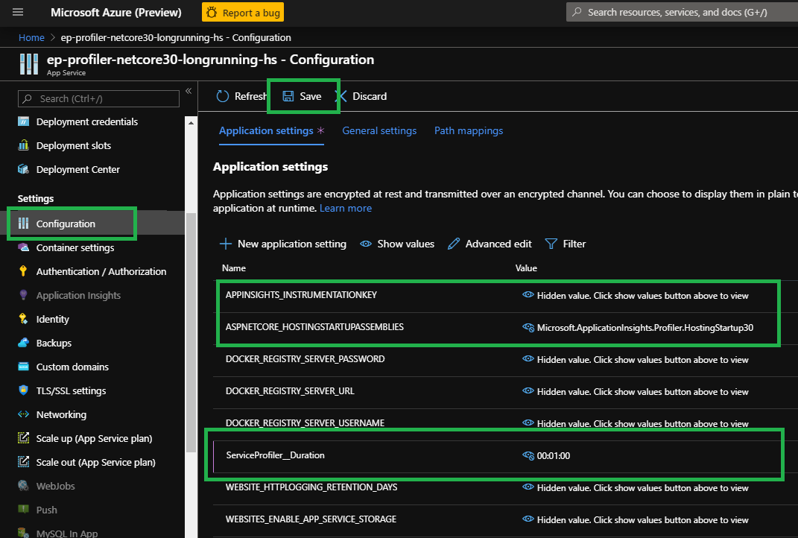
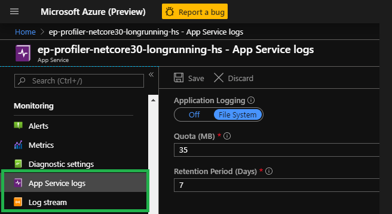

# Zero code to enable Application Insights Profiler for ASP.NET 3.x application in a container

[Use hosting startup assemblies in ASP.NET Core](https://docs.microsoft.com/en-us/aspnet/core/fundamentals/host/platform-specific-configuration?view=aspnetcore-3.0) allows ASP.NET Core 3.x application to enhance the startup experience. Application Insights Profiler makes use hosting startup to **enable zero code activation**. Here's how.

## Pre-requisition

* Basic knowledge of how to [Dockerize an ASP.NET Core application](https://docs.docker.com/engine/examples/dotnetcore/).
* A valid application insights connection string.

## The Plan

To use hosting startup for your project, there are 3 key elements:

* Reference the NuGet package of `Microsoft.ApplicationInsights.Profiler.AspNetCore` and the latest version of Application Insights SDK.
* Set the environment variable of `ASPNETCORE_HOSTINGSTARTUPASSEMBLIES=Microsoft.ApplicationInsights.Profiler.HostingStartup30`.
* Set the instrumentation key since it relies on Application Insights.

Neither step requires code change. Adding reference to NuGet package can be done by .NET Core CLI, and setting environment variables by docker instruction. The goal, apparently, is reachable.

## The Implementation

Let's begin with the Dockerfile from [Dockerize an ASP.NET Core application](https://docs.docker.com/engine/examples/dotnetcore/) from docker.com, notice that I've replaced the tag for both base images to `3.1`:

_If you choose to skip the process, refer to the final [dockerfile](./Dockerfile) and start [building the image](#Build-and-run-the-container-locally)._

```dockerfile
FROM mcr.microsoft.com/dotnet/core/sdk:3.1 AS build-env
WORKDIR /app

# Copy csproj and restore as distinct layers
COPY *.csproj ./
RUN dotnet restore

# Copy everything else and build
COPY . ./
RUN dotnet publish -c Release -o out

# Build runtime image
FROM mcr.microsoft.com/dotnet/core/aspnet:3.1
WORKDIR /app
COPY --from=build-env /app/out .
ENTRYPOINT ["dotnet", "DockerApp30HS.dll"]
```

There are small tweaks needed to make it work.

* Firstly, add reference to the NuGet packages, after the project file is copied and before restore happens:

```dockerfile
# Add reference to the latest stable version of Application Insights for ASP.NET Core.
RUN dotnet add package Microsoft.ApplicationInsights.AspNetCore --no-restore
# Adding reference to Microsoft.ApplicationInsights.Profiler
RUN dotnet add package Microsoft.ApplicationInsights.Profiler.AspNetCore -v 2.* --no-restore
```

As you already know, invoking `dotnet add` does nothing but update the project file. And running `COPY . ./` next will overwrite the change. To deal with it, copy everything before adding packages and do not copy it again later.

That should give us a good **build image**. Refer to [Dockerfile](./Dockerfile) for details.

* Then, we will need to setup 2 environment variables in the **runtime image**:

```dockerfile
# Setup environment variable for application insights connection string
ENV APPLICATIONINSIGHTS_CONNECTION_STRING=your-applicationinsights-connection-string
# Setup environment variable for hosting startup assembly
ENV ASPNETCORE_HOSTINGSTARTUPASSEMBLIES=Microsoft.ApplicationInsights.Profiler.HostingStartup30
```

After all tweaks, the image is ready to be built. Again, refer to [Dockerfile](./Dockerfile) for a complete example.

## Build and run the container locally

1. Pull the base images:

    ```docker
    docker pull mcr.microsoft.com/dotnet/core/sdk:3.1
    docker pull mcr.microsoft.com/dotnet/core/aspnet:3.1
    ```

1. Use the following commands to build and run your Docker image:

    ```docker
    docker build -t profiler-dotnet30-docker-hs .
    docker run -d -p 8080:80 --name profiler-dotnet30-docker-hs profiler-dotnet30-docker-hs
    ```

1. Generate some traffic to the following url for profiling:

    ```url
    http://localhost:8080/weatherforecast
    ```

1. Use the following command to check the logs:

    ```docker
    docker logs profiler-dotnet30-docker-hs
    ```

    The log will look like this:
    > info: Microsoft.Hosting.Lifetime[0] \
      Now listening on: http://[::]:80 \
    info: Microsoft.Hosting.Lifetime[0] \
        Application started. Press Ctrl+C to shut down. \
    ... \
    info: ServiceProfiler.EventPipe.Client.ServiceProfilerProvider[0] \
        Service Profiler session started. \
    ...

    Looking for the line of `Service Profiler session started` to make sure the Profiler is activated.

1. To kill the container once you finished verifying it locally:

    ```docker
    docker container rm profiler-dotnet30-docker-hs -f
    ```

## When running on Azure, as an Azure App Service

[Deploy the images built to Azure App Service](https://docs.microsoft.com/en-us/azure/app-service/containers/quickstart-docker) and it will run already. What special about running it in Azure is that it enables us to overwrite the environment variables. This is very useful in sense of:

1. Overwrite for the environment variables set in the docker file
    * You could set _APPLICATIONINSIGHTS_CONNECTION_STRING_ in app settings and the application will honor it;
        * I would setup 2 application insights resource. One for development only, one for production. The production connection string will only be protected and set only in the Azure App service settings.

    * You could set _ASPNETCORE_HOSTINGSTARTUPASSEMBLIES_ to decide whether to light up Application Insights Profiler or not.

    

1. Profiler supports custom configurations through app settings. For example:
    * Set `ServiceProfiler__Duration` to `00:00:30` will reduce the profiling time to 30 seconds.
    * Refer to [Configurations](https://github.com/microsoft/ApplicationInsights-Profiler-AspNetCore/blob/master/Configurations.md#configuration-references) for more options.

If there's a problem, logs will be useful. Turn on the logs in the Azure portal:


