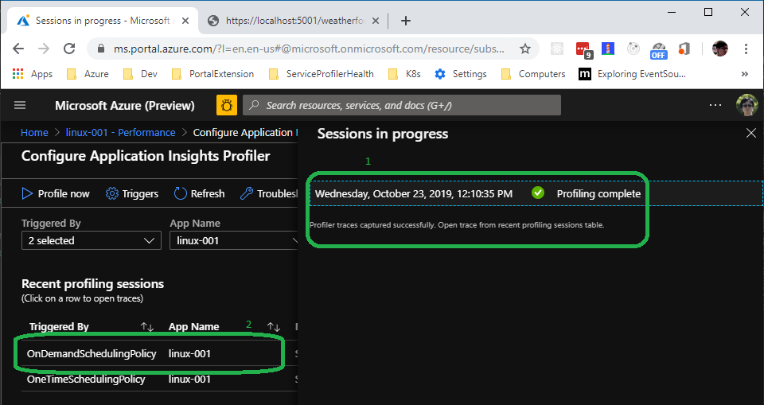

# Quick Start to build an ASP.NET Core 3.0 WebAPI with Profiler (Part I)

In this example, we will walk through the steps to build an ASP.NET Core 3.0 WebAPI with Application Insights Profiler enabled and run on Windows. The same steps work for .NET Core 2.2 application too.

Then, in the second part, we will containerized it to a Linux container.

## Prerequisites

1. [.NET Core **SDK** 3.0.100](https://dotnet.microsoft.com/download).
1. [An instrumentation key](https://docs.microsoft.com/en-us/azure/azure-monitor/app/create-new-resource) associated with a valid application insights resource in Azure.

## Get started

### Create an application

```shell
dotnet new webapi
```

### Add package reference

The latest Application Insights (2.8+) is required to run on .NET Core 3.0. And the profiler NuGet package, of course.

```shell
dotnet add package Microsoft.ApplicationInsights.AspNetCore
dotnet add package Microsoft.ApplicationInsights.Profiler.AspNetCore -v 2.1.0-*
```

### Update the code in `Startup.cs` to enable application insights and the profiler

```csharp
using System.Diagnostics;
...
        // This method gets called by the runtime. Use this method to add services to the container.
        public void ConfigureServices(IServiceCollection services)
        {
            ...
            services.AddControllers();
            // Adding the following lines to enable application insights and profiler.
            services.AddApplicationInsightsTelemetry();
            services.AddServiceProfiler();
        }
```

### Optionally, add a bottleneck

To make it fun, make use the following code to add some delay in the controllers to simulate the bottleneck:

```csharp
using System.Threading;
...
private void SimulateDelay()
{
    // Delay for 200ms to 5s to simulate a bottleneck.
    Thread.Sleep((new Random()).Next(200, 5000));
}
```

And then, call it from the controller:

```csharp
[HttpGet]
public IEnumerable<WeatherForecast> Get()
{
    SimulateDelay();
    var rng = new Random();
    return Enumerable.Range(1, 5).Select(index => new WeatherForecast
    ...
}
```

### Setup the instrumentation key for debugging

In [appsettings.Development.json](./appsettings.Development.json), add the following configuration:

```jsonc
{
    ...
    "ApplicationInsights": {
        "InstrumentationKey": "replace-with-your-instrumentation-key"
    }
    ...
}
```

Optionally, change the logging levels that the log will become more relevant. Refer [appsettings.Development.json](./appsettings.Development.json) for a full example.

### Generate traffic for profiling

At the beginning of the application, **OneTimeSchedulingPolicy** will immediately kick in, profiling for 2 minutes. Let's hit the endpoint in a browser during the profiling session:

```shell
https://localhost:5001/weatherforecast
```

It is suggested to hit the endpoint 10 more times since not all the samples are going to be valid. After 2 minutes, you will see logs like this:

```log
D:\Repos\fork-ai-profiler\examples\QuickStart3_0> dotnet run
info: ServiceProfiler.EventPipe.Client.ServiceProfilerProvider[0]
      Service Profiler session started.
info: Microsoft.Hosting.Lifetime[0]
      Now listening on: https://localhost:5001
info: Microsoft.Hosting.Lifetime[0]
      Now listening on: http://localhost:5000
info: Microsoft.Hosting.Lifetime[0]
      Application started. Press Ctrl+C to shut down.
info: Microsoft.Hosting.Lifetime[0]
      Hosting environment: Development
info: Microsoft.Hosting.Lifetime[0]
      Content root path: D:\Repos\fork-ai-profiler\examples\QuickStart3_0
warn: ServiceProfiler.EventPipe.Client.TraceValidators.ActivityListValidator[0]
      All activities are not found in the trace. First one: Stop/#19500/1/101/.
warn: ServiceProfiler.EventPipe.Client.ServiceProfilerProvider[0]
      Matched sample count does not equal to gathered sample count. Expected: 93, Actual: 71
info: ServiceProfiler.EventPipe.Client.ServiceProfilerProvider[0]
      Trace validation result: True
info: ServiceProfiler.EventPipe.Upload.TraceUploader[0]
      Service Profiler trace uploaded.
info: ServiceProfiler.EventPipe.Client.TraceUploader.TraceUploaderProxy[0]
      Finished calling trace uploader. Exit code: 0
info: ServiceProfiler.EventPipe.Client.ServiceProfilerProvider[0]
      Service Profiler session finished. Samples: 93
```

### Open the trace form Azure Portal

Get a coffee and wait for a couple of minutes - the backend needs some time, usually a 2 minutes, to ingest the data.

Then, open the application insights resource in Azure Portal, go to the **performance** blade, and use the button of `Configure Profiler`. There, you are going to see all profiling sessions:


_Tip: Click on the trace to open the trace analyzer._

### Try Profile Now

Keep the application running, click `Profile Now` on the page, you will see from the log that another trace session has been started:

```log
info: ServiceProfiler.EventPipe.Client.ServiceProfilerProvider[0]
      Service Profiler session started.
```

Now, hit the endpoint in the browsers to generate some traffic again.

And when the session finished, it will show up in the trace session list:


