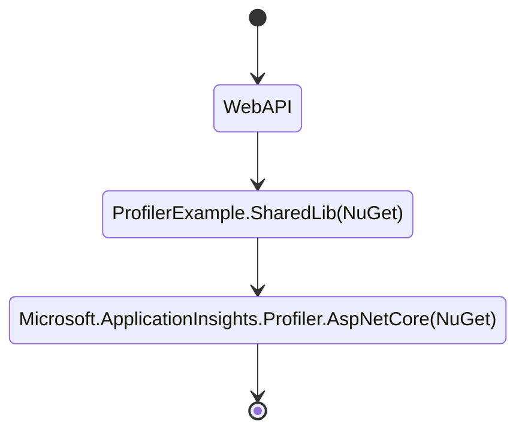

# Re-releasing Profiler.ASPNetCore package

It is common to have shared library in a solution. This example describes how to properly build a NuGet package of your own that carries profiler assets and could be reused across your own solution.

In this example, there are 2 projects, `WebAPI` is client project, that's the project we turn profiler on. `SharedLib` will be built into a NuGet package to simulate whatever the common package your want to build, with Profiler enabled. As per the `PackageId` property in [SharedLib.csproj](./SharedLib/SharedLib.csproj), it will be built into `ProfilerExample.SharedLib.1.0.0.nupkg`.



Here's a recommendation:

## Add reference to NuGet package

1. Add reference to `Microsoft.ApplicationInsights.Profiler.AspNetCore` is in `SharedLib`:

    ```xml
    <ItemGroup>
        <PackageReference Include="Microsoft.ApplicationInsights.Profiler.AspNetCore" Version="2.*" />
    </ItemGroup>
    ```

1. [KEY STEP] Setup the package to exclude `contentFiles` from private assets:

    ```xml
    <ItemGroup>
        <PackageReference Include="Microsoft.ApplicationInsights.Profiler.AspNetCore" Version="2.*">
            <!-- Default is contentfiles;analyzers;build as per: -->
            <!-- https://docs.microsoft.com/en-us/nuget/consume-packages/package-references-in-project-files#controlling-dependency-assets -->
            <PrivateAssets>analyzers;build</PrivateAssets>
        </PackageReference>
    </ItemGroup>
    ```
    Refer to [SharedLib.csproj](./SharedLib/SharedLib.csproj) for details. The key is to setup `<PrivateAssets>analyzers;build</PrivateAssets>` to exclude the `contentFiles` from private assets.

    _Tips: You might want to reference `Microsoft.ApplicationInsights.AspNetCore` in your shared project as well._

## Verify it works

1. Build the package

    ```shell
    SharedLib> dotnet pack -o ../Pkgs
    ```

1. Check the build output in [Pkgs](./Pkgs/) folder, expect to see `ProfilerExample.SharedLib.1.0.0.nupkg`.
1. Verify the NuGet package local source is configured correctly in [nuget.config](./nuget.config), specifically, the local source is added:

    ```xml
    <add key="local" value="Pkgs" />
    ```

1. Reference the built package:

    ```xml
    <PackageReference Include="ProfilerExample.SharedLib" Version="1.*" />
    ```

1. Now build the `WebAPI` project:

    ```shell
    WebAPI> dotnet build
    ```

1. Check that the file of `TraceUpload.zip` is included in the header project output at: `bin/Debug/net6.0/TraceUploader.zip`

1. In any header project, without reference profiler package again, you can then follow the other instructions to enable profiler.

## Feedback

If you have suggestions or if there is any questions, problems, please [file an issue](https://github.com/microsoft/ApplicationInsights-Profiler-AspNetCore/issues).